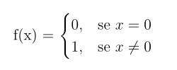

# URMGo
[](https://goreportcard.com/report/github.com/Herbrant/URMGo)
[](https://github.com/herbrant/URMGo/blob/master/LICENSE)

**URMGo** is a simple URM (*Unlimited Register Machine*) emulator written in [*Go*](https://golang.org/) to execute URM program.

## Getting Started

### Prerequisites
All you need to build and execute this software is **Go**, you can find how to install it on Windows, Linux or Mac in [Go official documentation](https://golang.org/doc/install).
Also if you want to use the *Makefile* you need **make** package.

### Build
```
$ git clone https://github.com/daxcpp/URMGo.git
$ cd URMGo
$ make
```

### Run
```
$ ./bin/URMGo URM_PROGRAM_SOURCE [R1, R2, R3, ... ]
```
where URM_PROGRAM_SOURCE is the path of your URM program and R1, R2, R3 are the input registers.

### URM Program example
This is an URM program example to calculate



```
examples/example1

1: Z(2)
2: J(1,2,5)
3: Z(1)
3: S(1)
4: J(1,1,0)
5: Z(1)
```

You can execute it with:
```
$ ./bin/URMGo examples/example1 x
```
There are also other examples [here](./examples) 

## Built with
* [Go](https://golang.org/)
* Love

## License
This project is licensed under the GNU General Public License v3.0 - see the [LICENSE](LICENSE) file for details

