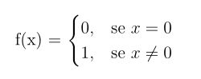
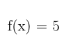
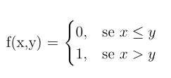
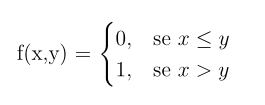
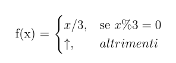
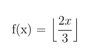

# URM Program Examples
Here you can find some URM program examples.

## Example 1


```
example1

1: Z(2)
2: J(1,2,5)
3: Z(1)
3: S(1)
4: J(1,1,0)
5: Z(1)
```

## Example 2


```
example2

1: Z(1)
2: S(1)
3: S(1)
4: S(1)
5: S(1)
6: S(1)
```

## Example 3


```
example3

1: J(1,2,5)
2: Z(1)
3: S(1)
4: J(1,1,0)
5: Z(1)
```

## Example 4


```
example4

1: J(1,3,5)
2: J(2,3,7)
3: S(3)
4: J(1,1,1)
5: Z(1)
6: J(1,1,0)
7: Z(1)
8: S(1)
```

## Example 5


```
example5

1: J(1,2,7)
2: S(2)
3: S(2)
4: S(2)
5: S(3)
6: J(1,1,1)
7: T(3,1)
```

## Example 6


```
example6

1:  T(1,2)
2:  J(1,3,6)
3:  S(2)
4:  S(3)
5:  J(1,1,2)
6:  S(4)
7:  S(4)
8:  S(4)
9:  J(4,6,13)
10: J(2,6,15)
11: S(6)
12: J(1,1,9)
13: S(5)
14: J(1,1,6)
15: T(5,1)
```
